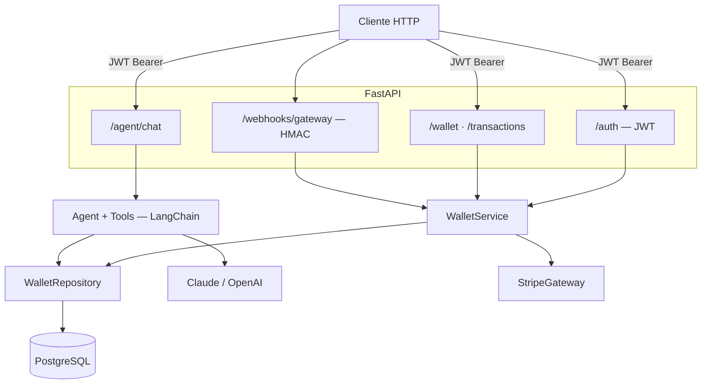

<h2 align="center">AI-Powered Digital Wallet</h2>
<h2 align="center">

</h2>

----

## Overview

Carteira digital com AI onde os usuários movimentam dinheiro por uma API REST e fazem perguntas em linguagem natural (“Qual é o meu saldo?”, “Maiores despesas deste mês”) por meio de um agente LLM com ferramentas com escopo por usuário, reduzindo a necessidade de consultas manuais ao suporte e mantendo os dados isolados por usuário.

*Stack:* Python, FastAPI, LangChain, Claude / OpenAI, PostgreSQL, Stripe, JWT, Docker Compose, pytest


## Arquitetura



---

## Documentação


| Documento                                              | Conteúdo                                                                  |
| ------------------------------------------------------ | ------------------------------------------------------------------------- |
| [docs/BUSINESS_SPEC.md](docs/BUSINESS_SPEC.md)         | Regras de domínio, requisitos funcionais e especificação do agente        |
| [docs/TECHNICAL_SPEC.md](docs/TECHNICAL_SPEC.md)       | Stack, estrutura do projeto e padrões de design                           |
| [docs/ARCHITECTURE.md](docs/ARCHITECTURE.md)           | Arquitetura, decisões de design e trade-offs                              |
| [docs/AUTH_GUIDE.md](docs/AUTH_GUIDE.md)               | Guia de autenticação JWT                                                  |


---

## Como começar

```bash
cp .env.example .env        # preencha suas chaves de API
docker compose up --build   # sobe a API + PostgreSQL
```

A API estará disponível em `http://localhost:8000`.  
Documentação interativa em `http://localhost:8000/docs`.

As tabelas são criadas automaticamente no startup da API (via `create_all`); não é necessário rodar migrações.

### Testando saques localmente

Por padrão, `STRIPE_SIMULATE_PAYOUTS=true` no `.env`. Nesse modo, a API **não** chama a Stripe
Payout API (que exige saldo real na conta da plataforma e não roteia PIX/conta bancária do
usuário). O fluxo espelha o depósito:

1. `POST /wallet/withdraw` — debita o saldo e retorna uma transação `PENDING` com `gateway_reference`
   (ex.: `po_sim_<transaction_id>`).
2. `POST /confirm-payout/{gateway_reference}` — marca o saque como `COMPLETED`.

Exemplo (PIX):

```bash
# 1. Iniciar saque
curl -X POST http://localhost:8000/wallet/withdraw \
  -H "Authorization: Bearer $TOKEN" \
  -H "Content-Type: application/json" \
  -d '{"amount": 10, "destination": {"type": "pix", "key": "user@example.com"}, "description": "teste"}'

# 2. Confirmar payout simulado (use o gateway_reference da resposta)
curl -X POST "http://localhost:8000/confirm-payout/po_sim_<transaction_id>" \
  -H "Authorization: Bearer $TOKEN"
```

Para usar payouts reais da Stripe em produção, defina `STRIPE_SIMULATE_PAYOUTS=false` e configure
webhooks para `payout.paid` / `payout.failed`.

---

## Como rodar os testes

Os testes só rodam dentro do container `api` — não é necessário Python/pytest na máquina host. Com a API e o
PostgreSQL já em execução (`docker compose up`):

```bash
docker compose exec api pytest
```

A cada sessão de testes, o `tests/conftest.py` recria do zero um banco `wallet_test` descartável na mesma
instância do serviço `db` (via `settings.test_database_url`), isolado do banco `wallet` usado em desenvolvimento.

---

## Estrutura

```
src/
  auth/       — registro e autenticação JWT
  wallet/     — domínio da carteira (service, repository, router)
  gateway/    — abstração PaymentGateway + Stripe
  agent/      — agente LLM com tool use (LangChain)
tests/
  unit/       — domínio e ferramentas do agente (sem DB/HTTP)
  integration/ — fluxos E2E via AsyncClient
```

---

## Requisitos

- Python 3.11+
- Docker / Docker Compose
- LangChain para o agente — o provider de LLM é trocável via configuração
- Sem frontend — apenas a API
